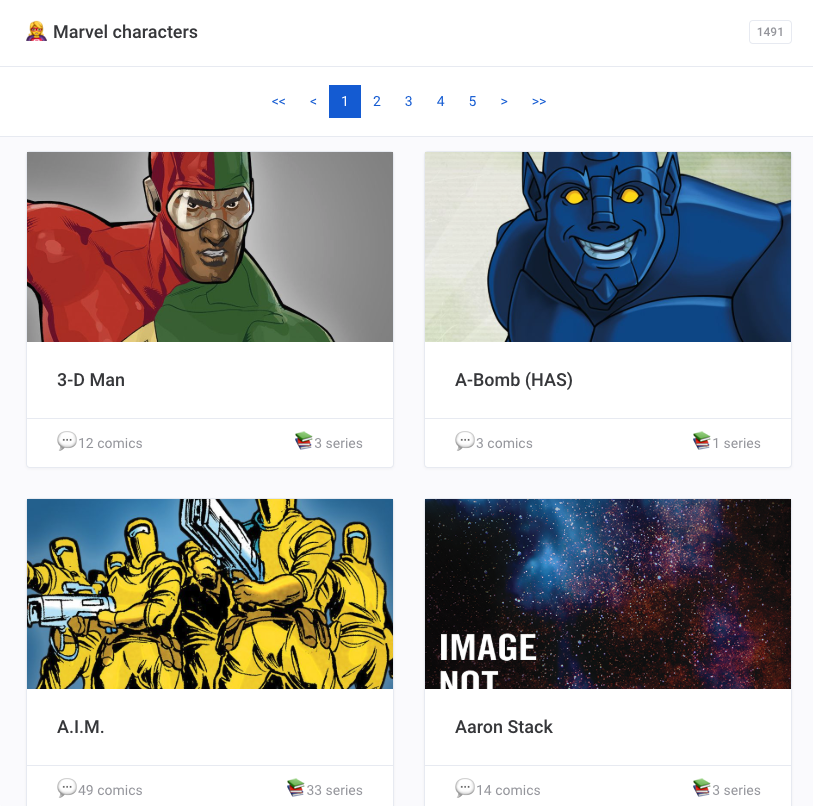

# MARVEL

> Marvel [Characters](https://www.marvel.com/characters) portfolio

[](http://ec2-18-216-242-220.us-east-2.compute.amazonaws.com/)

## 🐣 Introduction

Very - _very very_ - minimalist portfolio of Marvel Characters based on [Marvel API](https://developer.marvel.com/documentation/getting_started)

## 💻 [Live demo](http://ec2-18-216-242-220.us-east-2.compute.amazonaws.com/)

## 🏗️  Installation

```sh
❯ git clone git@github.com:92bondstreet/marvel.git
❯ cd marvel
```

**Note:**

* Bootstrapped with [create-react-app 3.0.1](https://github.com/facebook/create-react-app/blob/master/CHANGELOG.md)
* Based on [React Hooks](https://reactjs.org/docs/hooks-intro.html) (at least React 16.8)
* [Yarn](https://yarnpkg.com) is the package manager
* Hosted by Docker if needed

### `/client` Configuration (.env)

`REACT_APP_MARVEL_PROXY_API`

Base url of the proxy server api

### `/server` Configuration (.env)

`NODE_ENV`

Determine the way to host the client files generated by `create-react-app`

`MARVEL_PUBLIC_KEY`

the Marvel Comics API public key

`MARVEL_PRIVATE_KEY`

the Marvel Comics API private key

## 🕹️  Usage

```sh
## sandbox for dev purpose
## will start the client and server side in containers
❯ make sandbox
```

#### without docker

```sh
❯ make install
## create client/.env and server/.env files with the right env variables
❯ make sandbox-local
```

## 📦 Distribution and Packaging

```sh
## build and start a ready-production web application with docker
❯ make build
```

#### without docker

```sh
❯ make build-local
```

## 📱 Features

- [X] 🦸 Display a grid of characters (name, thumbnail, number of comics and series)
- [X] 📄 Paginate and/or select a given page
- [x] Loading placeholder during characters fetching
